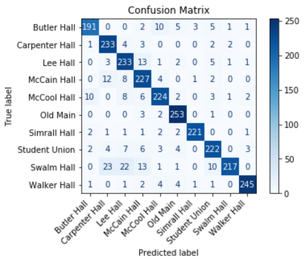

# Campus Vision AI Challenge

We built this model as part of the MSU AI Club [Campus Vision AI Challenge](https://github.com/sushant097/MSU-AI-Club-Campus-Vision-Challenge). We developed the model using TensorFlow and Keras, focusing on creating an image classification model to identify 10 distinct buildings in our university. The dataset comprised over 12,700 images distributed across 10 classes.

## Dataset Composition

The dataset included images for the following buildings:

- **Butler Hall**: 1,167 images
- **Carpenter Hall**: 1,198 images
- **Lee Hall**: 1,261 images
- **McCain Hall**: 1,277 images
- **McCool Hall**: 1,354 images
- **Old Main**: 1,362 images
- **Simrall Hall**: 1,190 images
- **Student Union**: 1,337 images
- **Swalm Hall**: 1,361 images
- **Walker Hall**: 1,260 images

## Model Optimization

To optimize the training process, we used:

1. [**ReduceLROnPlateau**](https://keras.io/api/callbacks/reduce_lr_on_plateau/): Reduces learning rate when a metric has stopped improving.

2. [**Early Stopping**](https://keras.io/api/callbacks/early_stopping/): Stops training when a monitored metric has stopped improving.

The initial training was set for 100 epochs, but the model stopped training after 40 or so epochs due to early stopping.

## Confusion Matrix

We also generated a confusion matrix to evaluate our model's performance. This matrix shows how our model misclassifies buildings, providing insights into the model's strengths and weaknesses in distinguishing between different structures.

---------------------------------------------------------------
Special thanks to [Masrafee](https://github.com/MasrafeeMasiat) for his guidance throughout this project.
